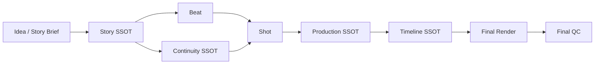
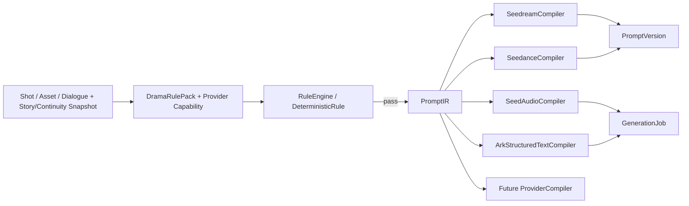
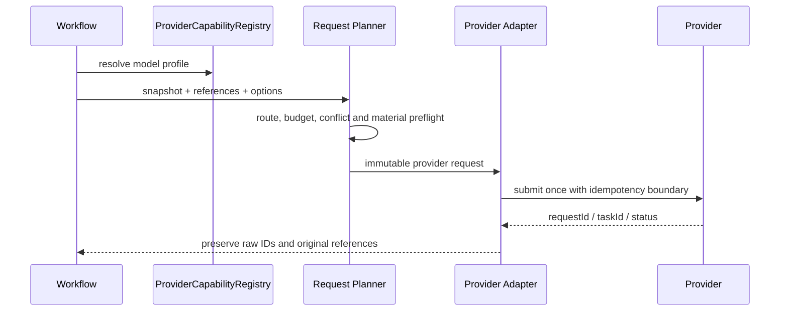
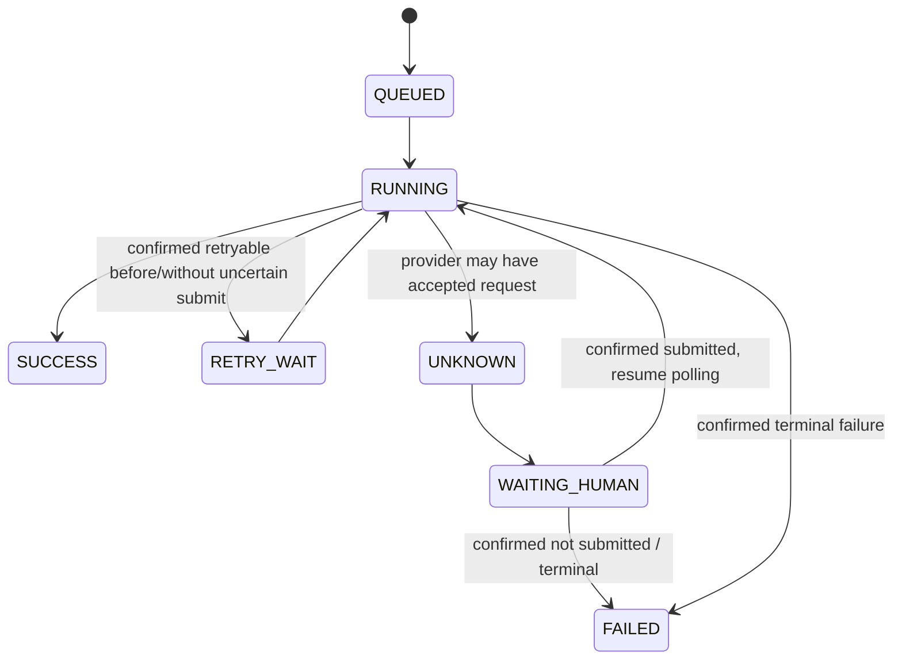
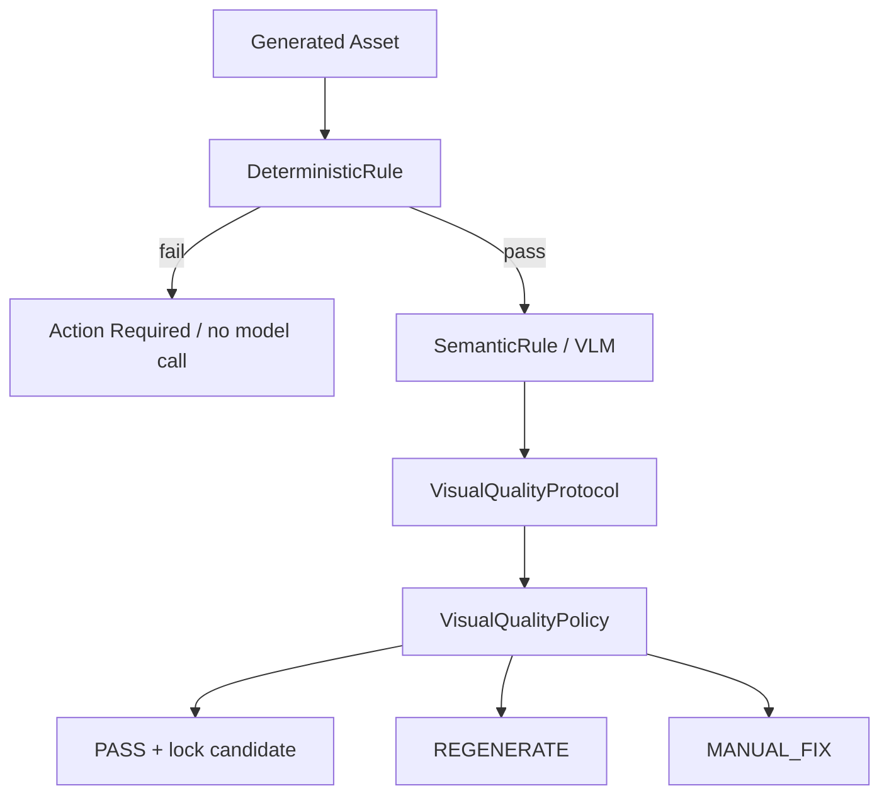
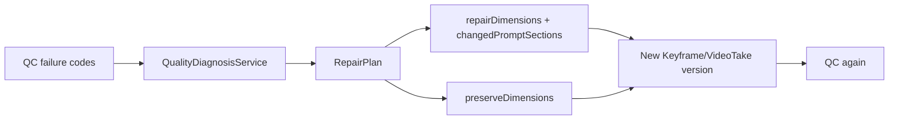
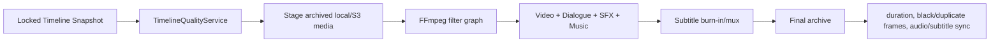

# AI short drama platform architecture V2

V2 按四个真相源组织生产数据。任何模型输出都只是候选内容；只有经过 Schema、确定性规则、审查和版本锁定的数据才能成为下游输入。工作流服务负责协调，不重新推导领域事实。

## Story SSOT

Story SSOT 是当前确认版本的 `STORY_DOCUMENT` 链：`STORY_BRIEF → CORE → OUTLINE_BATCH → EPISODE_SCRIPT`。项目保存 `activeStoryDocumentId`；修改已确认文档会创建新版本并使受影响的下游版本失效，不覆盖历史。

- `StoryProfile`：setting、storyType、audience、tropes、tones 和 intensity，彼此保持正交。
- `StoryFormat`：narrativeForm、presentation、orientation 与 formatId，不用时长猜真人/动画/漫画。
- `EpisodeFormat`：单集时长、节拍数、场景密度、中段 Hook 和发行档位。
- `DramaRulePack`：按阶段组合节奏、Hook、对白/场景密度、断章、视觉风格和上游规则指纹。
- `CORE`：世界规则、角色身份、地点拓扑、道具身份、主线、人物弧光和连续性规则。
- `StoryFact` 与不可变 `StoryFactMutation`：按 storyTime 形成可重放的剧情事实版本。

只有 `CONFIRMED` 文档能触发下一阶段。某批集纲或某集剧本失败时只恢复该文档对应的 GenerationJob。

## Continuity SSOT

Continuity SSOT 由确认的 CORE 身份事实、按 storyTime 查询的状态记录和已接受 Take 的观察结果共同组成：

- 永久身份：Character、Location、Prop 及其已批准 AssetView 版本。
- 可变状态：CharacterState、LocationState、PropState、Relationship、StoryFact/Knowledge、VoiceState。
- 计划状态：Shot.startState / Shot.endState、Blocking、ActionState、storyTime。
- 实际状态：selected + locked + QC PASSED 的 VideoTake.observedState。

`ContinuityEngine` 生成当前镜头的可复核快照；`RuleEngine` 在任何付费语义评估前运行 `DeterministicRule`。角色/道具不存在、上一 Take 未接受、起止状态不一致、服务商时长越界、轴线或画面方向错误均由 Java 阻断。表演自然度、情绪、张力和构图才进入 `SemanticRule`/VLM。

重新生成历史镜头时，Replay Original 使用该镜头保存的输入快照和版本；Regenerate Latest 明确使用当前创作配置。两者都不能把未来 storyTime 状态泄漏回历史镜头。

## Production SSOT

Production SSOT 是可追踪的生产版本链：

`Episode → Scene → Beat → Shot → PromptVersion → AssetView/Keyframe → VideoTake → AudioClip/QCResult`

- Beat 保存叙事职责、事件、信息/情绪变化和反应主体。
- Shot 保存唯一动作、机位、Blocking、起止状态、所覆盖 Beat 与连续关系。
- PromptVersion 同时保存 PromptIR、最终 Provider 文本、compiler/model/rule pack fingerprint 和引用快照。
- Keyframe、VideoTake、AudioClip 保留 provider request/task ID、原始 ProviderReference、归档位置、来源版本、采用和锁定状态。
- PREVIS 由 `MediaPurpose.PREVIS` 表达并可跳过；KEYFRAME 是视频边界帧，二者用途不混淆。

## Timeline SSOT

最终播放顺序只来自锁定的 Timeline 和 TimelineItem。Storyboard、Shot 顺序或“最新 Take”不能在渲染时重新组装成片。

TimelineItem 保存 sourceTakeId/sourceAudioId、in/out、timelineStart、duration、speed、volume、transition、editOperations 和替换历史。`EditingEngine` 校验 CUT/TRIM/REACTION_SHOT/INSERT_SHOT/J_CUT/L_CUT/AUDIO_BRIDGE/DIALOGUE_GAP/PAUSE/CLIP_REPLACE；Clip Replace 只能使用同 Shot、已采用、已锁定、QC 通过且已归档的 Take。

## Prompt Flow

PromptIR 固定 subject、identity、costume、environment、action、emotion、blocking、camera、lighting、continuity、audio、dialogue 和 negativeConstraints。Story、Story QA、Director、关键帧、视频、素材多视图、口型同步和 TTS 均先进入 `PromptCompiler`；任务快照保存 PromptIR。ProviderCompiler 只翻译协议和长度预算，Provider Adapter 只负责参数、媒体与 HTTP，不重新解释剧情。

## Provider Flow

Seedream 的原始 ProviderReference 优先交给 Seedance；下载归档只用于预览、QC 和恢复，不自动替代授权链引用。适配器在 HTTP 前拒绝不支持的参数和时长。

## Task Flow

GenerationJob 是每次服务商调用的真相源，保存 localTaskId、phase、provider/model、requestKey、输入快照、重试次数、服务商 ID、耗时和失败原因。PipelineRun/StageRun 只聚合进度并关联 GenerationJob。提交结果不确定时禁止自动重交和重复扣费。

## QC Flow

QCResult 按维度保存 score、confidence、reason 和可见 evidence，并保留 providerRequestId。自动结果默认 shadow；达到配置置信度才允许应用，连续同类失败达到上限转人工。

## Repair Flow

返修不覆盖旧版本。故事状态错误先修 Story/Continuity；Prompt 错误重编译；Provider 输出偏差才允许同输入重试。每次只修失败维度并声明必须保持的正确维度。

## Render Flow

Render 只读取已锁定 Timeline 快照和已归档素材。停帧使用源裁剪加 `tpad`，J/L Cut 和音频桥保持独立音画时序；缺失视频/音频、越界裁剪、空白镜头和时长漂移在渲染前后分别检查。

## 恢复与版本原则

1. 所有付费任务先持久化输入快照和 requestKey，再提交。
2. 已成功阶段不会因后续失败丢失；重试定位到批次、Episode、Shot 或 Take。
3. 已锁定版本不可原地修改；编辑产生新版本并保存 provenance。
4. Provider 原始错误、requestId/taskId 和不完整输出都进入审计记录。
5. 新题材通常只新增 StoryProfile/StoryFormat/DramaRulePack 数据和 Skill 规则，不修改 Java 主流程。
