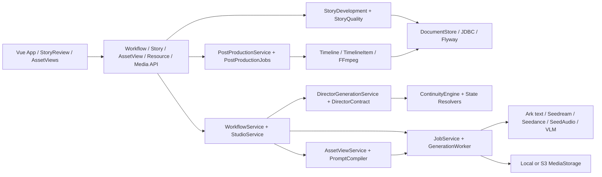

# V2 代码审计（第一阶段）

审计基线：`e09b1e6`，2026-09-23。此文档记录当前实现，不把任务书中的目标模型误写成既有能力。逐文件清单见 [v2-code-audit-inventory.md](v2-code-audit-inventory.md)。审计范围包括 Java、Vue/JS、Flyway SQL、配置、脚本、prompt/skill、测试和 fixture。清单中的“静态调用”仅是线索；Spring DI、`ResourceKind` 动态资源路由、Jackson、Flyway、class path skill 加载和测试反射须作为独立保留依据。

## 当前完整模块图

| 模块 | 主要入口 | 当前职责与依赖 |
|---|---|---|
| 页面 | `frontend/src/App.vue`, `StoryReview.vue`, `AssetViews.vue` | 创建与审查项目、素材、镜头、Take、任务和时间线；通过 HTTP/SSE 调用 API |
| API | `api/*Controller` | HTTP 边界；其中 `WorkflowController` 聚合导演、媒体、质检、后期和任务操作 |
| 故事 | `StoryDevelopmentService`, `StoryQualityService` | 分阶段文本生成、审查、存储、故事质量规则；依赖 schema、skill、LLM、DocumentStore |
| 导演 | `DirectorGenerationService`, `DirectorContract` | Scene plan/detail 两阶段生成、JSON schema、归一化、校验、Shot 物化；依赖状态/节拍/时长规则 |
| 连续性 | `ContinuityEngine`, `ContextResolver`, `*StateResolver` | 镜头连续性与故事时间查询；当前并非唯一连续性决策入口 |
| 素材和媒体 | `AssetViewService`, `WorkflowService`, `PromptCompiler` | 多视图、分镜、关键帧、视频请求；参考授权与 QC 门禁 |
| 任务 | `JobService`, `GenerationWorker` | 提交、轮询、恢复、服务商 ID 和状态；`PipelineRunService` 另有阶段运行状态 |
| 服务商 | `provider/*`, `model/*` | mock/live 适配器、Ark HTTP、能力/参数校验、图像、视频、语音、VLM |
| 持久化 | `DocumentStore`, `JdbcDocumentStore`, `ResourceKind`, Flyway | 通用 JSON 文档及关系列、资源注册、事务；不能仅凭 Java 静态引用删除表或枚举项 |
| 后期 | `PostProductionService`, `PostProductionJobs`, `ProductionService` | 音频、时间线、FFmpeg 渲染与终片 QC |

## 重复职责和数据真相源冲突

| 编号 | 证据 | 冲突 / 风险 | 建议归属 |
|---|---|---|---|
| A-01 | `DirectorStyleResolver` 接受 `averageShotLength=1..8`；`DirectorContract.planSchema`, `shotBounds`、`normalizePlanDurations` 和 `DirectorGenerationService.fallbackPlan` 固定 2..5 | 24 秒场景会因为“每镜 2..5 秒”被强制切成约 5..12 镜；镜头数由数学区间而非 Beat/信息变化决定；前后端估算不一致 | Story/Beat 决定镜头必要性；ProviderCapability 决定单次生成可用时长；编辑时长独立 |
| A-02 | `DirectorDurationPolicy` 将 edit/provider duration 都截到 5；`WorkflowService.video` 再按 Shot duration 创建 provider 选项 | duration 至少有 scene、shot、editDuration、providerDuration 四个来源，限制混入 Domain | 明确 Scene 目标时长、Shot 编辑时长、Provider 请求时长和 Timeline 裁剪时长的单向推导 |
| A-03 | `DirectorContract` 同时建 schema、归一化、空间/状态校验、时长和物化；`ContinuityEngine`、`*StateResolver`、`CrossShotQc`、`SequenceBoundaryGate` 也判断连续性 | 同一状态可能在导演、上下文、QC 阶段得出不同答案 | `ContinuityEngine` 产出可持久化快照；导演只提出变更，QC 对比计划与观察 |
| A-04 | 已收敛：Story、Story QA、Director、AssetView、Keyframe、Video、LipSync 与 Voice 都通过 `PromptCompiler` 形成可审计 PromptIR；Skill/RulePack 仍是创作规则来源，Provider Adapter 只传输编译结果 | 若未来新任务在 Service/Provider 中重新拼业务文本，会再次形成不可追踪旁路 | `PromptBoundaryContractTest` 作为静态边界门禁；新任务必须先扩展 PromptIR/ProviderCompiler |
| A-05 | `STORYBOARD` 和 `KEYFRAME` 都是图像资源与 UI 操作，且 Storyboard 可成为 Keyframe 参考 | 两者用途可能重叠，强制前置会多一次付费调用 | 先在测试中确认 PREVIS 与视频首帧的消费方，再引入 MediaPurpose 和可跳过 PREVIS |
| A-06 | `StoryBible` 资源、`STORY_DOCUMENT` CORE、各 State/Fact/Knowledge 表同时保存剧情事实 | 锁定事实及变更授权边界不够显式；不能凭名称合并数据 | CORE/StoryBible 为已确认事实，状态/知识为 storyTime 投影；需版本和 mutation 记录 |
| A-07 | `GENERATION_JOB` 与 `PIPELINE_RUN`/`STAGE_RUN` 都有状态；前端分别展示 | 用户可能看见阶段运行但看不见当前真实 provider 请求，或误以为排队重复提交 | Job 为服务商调用真相源，StageRun 为聚合进度，需 ID 关联 |
| A-08 | `PostProductionJobs` 构造 TimelineItem 并渲染，`ProductionService.planTimeline` 再转换为 FFmpeg 参数 | Timeline 是最终剪辑入口，但 `TimelineItem` 的 source Take/version 不一定为强制关系 | Timeline/Clip 作为终片 SSOT，渲染仅读取已锁定 Timeline 快照 |
| A-09 | `ProviderCapabilityRegistry` 已存在，但导演 Schema 固定 2..5；Seedream 参数支持与模型能力未按 model ID 分层 | 服务商模型变化可造成请求直接失败。上一轮 live 请求因 Seedream 5.0 Pro 不支持 `guidance_scale` 被明确拒绝 | 能力按实际模型/官方协议建模，适配层在请求前拒绝不支持参数 |

## 初始删除 / 合并候选及最终结论

| 候选 | 当前证据 | 删除前必须再验证 | 风险 |
|---|---|---|---|
| `scripts/__pycache__/live_pipeline_check.cpython-314.pyc` | Python 编译缓存，不是源码 | 已确认无运行时依赖并删除；由 `.gitignore` 阻止再次进入版本库，详见 `v2-deletion-report.md` | 已完成 |
| `src/main/resources/static/demo/*` | mock 演示媒体；`MockImageGenerator`/`MockVideoGenerator` 可能直接返回它们 | 查 mock、e2e、前端预览、classpath 引用 | 中，暂留 |
| `StoryDevelopmentDemo` | mock 故事结构数据 | 确认 `MockLlmGateway`、测试 fixture 和离线生产验收关系 | 中，暂留 |
| 旧兼容路由/枚举、Storyboard/PREVIS | 名称存在交叠 | 检查 HTTP 客户端、历史数据、Flyway、测试与资源反射路径 | 高，暂留 |
| `DirectorContract` 中重复的空间/时长判断 | 与 Continuity/Duration policy 交叉 | 逐条提取失败用例、迁入唯一职责后确认无调用 | 高，渐进迁移 |

## 建议保留

`DocumentStore`/`JdbcDocumentStore` 事务、Flyway V1–V16、`GenerationJob` 幂等/未知提交保护、所有已归档 Provider URL/ID、`CharacterStateResolver` 的 storyTime 查询、`ContinuityEngine`、`ProviderCapabilityRegistry`、Take 历史版本与 QC 记录、Timeline/FFmpeg、mock Provider/fixture。历史 migration 不修改、不删除。生产使用的 Spring Bean 即使没有 `new` 调用也保留。Prompt/skill 资源由 classpath 和 manifest 动态加载，不能按静态调用数判断为无用。

## P0 修改顺序

1. **P0-00 基线红灯**：`04-script-writing` skill prompt 与 manifest SHA-256 不一致。现有失败测试已复现；刷新清单指纹与派生 catalog，然后完整回归。
2. **P0-01 镜头时长/数量冲突**：新增失败测试覆盖 24 秒 Scene 的少镜头合理方案、可变镜头长度、Provider 能力适配；最小修改导演 Schema/时长策略/兜底规划，避免凭 2..5 秒硬编码填镜。保留准确总时长校验。
3. **P0-02 付费调用安全**：审计并测试 UNKNOWN/响应丢失/重启恢复/重复点击，确认相同 requestKey 不重复提交；仅修实测缺口。
4. **P0-03 参考授权与版本**：合同测试确认 Seedream 原始引用优先进入 Seedance，归档图只用于预览/QC；校验 Take→Shot→Beat→Scene→Episode 可追踪。
5. **P0-04 已 QC 视频门禁与 CONTINUOUS**：用失败用例复现“已 QC 但不可生成视频”及 previousTake 状态不完整，再逐项修。
6. **P0-05 Timeline SSOT**：测试终片只按 Timeline 顺序与入出点渲染，不从 Shot 列表重建；先修错轨/错序，不先改造整套剪辑 UI。

后续 P1：Beat 一等实体、StoryFactMutation/知识边界、ActionState/Blocking IR、维度 QC/RepairPlan、Script Doctor、任务可视化。P2：成本估算、通用题材 RulePack、PREVIS 成本策略、代码减法与文档。每项都须先有可复现失败测试，修复后跑局部和完整回归。

## 当前测试基线

- `frontend`: 8/8，构建通过。
- 后端：417 项，416 通过、1 失败。失败：`SkillCatalogManifestTest.validatorUsesManifestCardinalityInsteadOfTheLegacyCatalogConstant`，实际错误为 `04-script-writing fingerprint does not match promptPath`。
- 本轮启动时 `git status` 干净，HEAD `e09b1e6`。
- 当前本地 HTTP 服务不可访问；上一轮真实 24 秒项目状态存于本地数据库，但本次新目标先从代码审计开始。未把旧 live 任务标记为完成，也未重新提交其付费请求。

## 已处理问题与验证

| 问题 | 失败复现 | 最小修复与迁移 | 回归 | 状态 |
|---|---|---|---|---|
| P0-00 skill 指纹失配 | 原有 `SkillCatalogManifestTest` 失败，`04-script-writing` 指纹不符 | 刷新 manifest 与两个派生 catalog；无数据库迁移 | 前端 8/8、后端 417/417 | DONE |
| P0-01a 镜头长度误用服务商片段约束 | 24 秒、平均 8 秒时契约至少要求 7 镜；8 秒镜头物化成 2.2 秒；`StudioService` 拒绝保存且 V1 数据库 CHECK 拒绝插入 | 放宽导演契约、时长归一化和演示规划；保留创作时长到编辑时间；V17 只替换 `shot.duration` 的旧 CHECK，不改 V1 | 前端 8/8、后端 421/421；`git diff --check` 通过 | DONE |
| P0-01b 服务商视频时长被静默缩短 | 向 Seedance 2.5 请求 31 秒，适配器实际发送 30 秒且已执行付费 POST | 在适配器按 `ProviderCapabilityRegistry.supportedDurations` 升档；超过最大能力时在 HTTP 前报 `DURATION_UNSUPPORTED` | 前端 8/8、后端 423/423 | DONE |
| P0-01c 运行时导演指令仍固定 2～5 秒 | `RuntimeSkillResourceTest` 确认 classpath Prompt 包含硬规则 | 修改 `skills/06-shot-planning` Prompt/Skill，刷新 manifest/catalog 指纹 | 前端 8/8、后端 424/424 | DONE |
| P0-01d 过短镜头直到后期才失败 | 6 秒场景、平均 1 秒时规划允许超过剪辑能力的镜头数；Studio 可保存 1 秒镜头，而后期只接受 ≥1.25 秒 | 新增唯一 `EditorialTiming`；规划、持久化、时间线及后期共用 1.25 秒下限；V17 同步数据库 CHECK；24 秒 3 镜和 5 秒快节奏镜头均可落盘 | 前端 8/8、后端 428/428 | DONE |
| P0-01e 连续性引擎残留 2～5 秒旧规则 | 8 秒镜头和 1.25 秒镜头仍被 `ContinuityEngine` 报 `ATOMIC_DURATION`，与导演、持久化和剪辑时长域冲突 | 连续性引擎复用 `EditorialTiming.MIN_SHOT_SECONDS`，只检查全链路最小时长；视频上限继续由具体 Provider 能力校验 | 前端 11/11、后端 447/447；`git diff --check` 通过 | DONE |
| P0-02a 相同请求标识复用不同输入 | `JobBudgetReservationIntegrationTest` 复现：同一 requestKey、同 type/shot 但输入变更时静默返回旧任务 | `JobService.enqueue` 比对完整输入快照；不同输入报 `IDEMPOTENCY_CONFLICT`，不预留预算也不创建任务 | 前端 8/8、后端 429/429 | DONE |
| P0-02b 服务商已接单、首次本地写入失败 | 故障注入复现：Seedance 返回 taskId 后，首次 `jobs.mutate` 抛数据库异常；任务失败但未标记提交不确定，可重试 | 把首次接单记录放进已有接单后异常保护区；失败进入对账门禁，不自动重交 | 前端 8/8、后端 430/430 | DONE |
| P0-02c 页面层幂等捷径绕过输入校验 | 相同视频 requestKey、不同分辨率时，`WorkflowService.existingJob` 直接返回旧任务，绕过 `JobService` 的严格校验 | 图片与视频任务保存 `clientRequestSnapshot`；提前返回前比对原始请求内容 | 前端 8/8、后端 431/431 | DONE |
| P0-04 连续参考路线缺少视频仍被接受 | 已选、已锁、QC PASSED 的 previousTake 但无 videoUrl/reference_video 时，`REFERENCE_GENERATE` 仍返回可提交路线 | 路由解析必须确认至少一个可用 video_url；否则在付费调用前报 `PREVIOUS_VIDEO_REQUIRED` | 前端 8/8、后端 432/432 | DONE |
| P0-04b 任意视频素材替代上一镜 | previousTake 的 videoUrl 缺失时，任意 video 绑定可充当续接素材；存在不同 video 绑定时也会漏掉已选 previousTake | 连续参考路线必须携带已选 previousTake 的 videoUrl，其他 video 不能替代 | 前端 8/8、后端 434/434 | DONE |
| P1-Action-01 动作状态是自由文本且进度可倒退 | 导演 Schema 的 `actionState` 为字符串；同一动作在单镜内从 0.65 回退到 0.40 未被拦截；对象状态变化在视频 Prompt 中被渲染为空 | 建立 `ActionState(action, progress, hand, object)`；导演 Schema、Fake Provider、状态增量与 PromptIR 统一使用结构；连续性引擎校验结构和单调进度 | 前端 11/11、后端 449/449；`git diff --check` 通过 | DONE |
| P1-Blocking-01 道具位置与移动方向仅有自由文本 | `basicBlocking` 没有结构化道具位置和人物 movementVector；Blocking 中的道具位置可与起始状态冲突且不报错 | Director Schema/Fake/Skill 增加 `characters[].movementVector` 与 `props[].propId/worldPosition`；服务端按连续性台账物化，ContinuityEngine 校验冲突，PromptIR 保留同一结构 | 前端 11/11、后端 451/451；`git diff --check` 通过 | DONE |
| P1-Shot-01 无效/重复镜头缺少确定性门禁 | 空目的、空视觉信息、相邻语义完全重复、状态/信息/情绪均未变化的镜头均可通过；新增门禁后也揭露 Fake Director 会连续产出相同占位镜头 | `DirectorPlanValidator` 增加 `SHOT_NO_PURPOSE`、`NO_VISUAL_INFORMATION`、`DUPLICATE_INFORMATION`、`NO_STATE_CHANGE`、`SHOT_CAN_BE_REMOVED`；Fake Director 改为按建立空间、动作、反应、结果揭示生成不同职责 | 前端 11/11、后端 453/453；`git diff --check` 通过 | DONE |
| P1-Beat-01 Beat 只存在于任务/Shot 快照 | 完成导演规划后 `ResourceKind.fromPath("beats")` 不存在，Shot 无独立 Beat 记录 | V18 新建 Beat 表与资源类型；存储版本、顺序、来源计划并将 Shot 绑定 `beatResourceId`，旧 Beat 保留并标记 stale | 前端 8/8、后端 435/435 | DONE |
| P1-Beat-02 镜头详情失败会让 Beat 实体缺失 | 导演计划成功、镜头详情未完成时 Beat 表为空 | Beat 在已校验计划阶段独立保存为 PLANNED；详情完成后激活为 ACTIVE，失败可续跑 | 前端 8/8、后端 436/436 | DONE |
| P1-UI-01 拆镜仅有短暂提示 | 导演台不能区分剧情节拍生成、镜头详情批次及失败位置 | 按场景汇总导演计划与详情任务，常驻显示批次进度、失败原因和服务商 ID；运行中禁用重复提交 | 前端 9/9、后端 436/436 | DONE |
| P1-Beat-03 Beat 语义字段被固定清空 | `knowledgeChange/setup/payoff` 未进入模型契约且持久化时写 null | 将观众/角色知识变化、伏笔、回收纳入结构化契约；Beat 保存动作、事实变化与完整知识语义 | 前端 9/9、后端 436/436 | DONE |
| P1-Shot-01 Shot 缺少正式叙事语义 | 镜头只保留旧的 `dramaticJob/visualFocus/feltIntent`，下游无法稳定读取规范字段 | 由已校验的 Shot 与 Beat 派生并保存 `narrativeFunction/visualInformation/audienceLearn/emotionChange`，不让下游重新猜测 | 前端 9/9、后端 437/437 | DONE |
| P0-02d 服务商最终状态未知被写成失败 | 视频任务已提交，但轮询鉴权/网络连续异常后写 `FAILED`，页面无对账入口 | 新增 `UNKNOWN/WAITING_HUMAN` 正式状态与 V19；保留原 taskId，阻止重复生成，并允许核对后恢复原轮询 | 前端 9/9、后端 437/437 | DONE |
| P1-Task-01 任务中心字段不完整 | 任务缺少稳定 `localTaskId/phase/provider/model/retryCount/elapsed`，页面只能看到类型和百分比 | 任务创建即写入规范字段，状态迁移同步阶段与耗时；最近任务和拆镜场景常驻展示完整执行信息 | 前端 10/10、后端 438/438 | DONE |
| P1-UI-02 缺少制作进度总览 | 只能分别进入各工作台，无法看到 Script→Render 的实际完成量与阻塞任务 | 首页按真实资源计算 10 个生产阶段进度，并汇总 Provider Failed、Unknown、Waiting Human 阻塞 | 前端 11/11、后端 438/438 | DONE |
| P1-Story-01 Script Doctor 只有散装文本 | `issues` 是字符串数组且模型的 `passed=true` 可与 BLOCKER 语义冲突 | 结构化 ScriptIssue（代码/严重度/类别/证据/位置/建议）；确定性策略强制 BLOCKER 进入阻断与定向改写 | 前端 11/11、后端 439/439 | DONE |

P0-01a 修改 `DirectorContract`、`DirectorDurationPolicy`、`DirectorGenerationService`、`StudioService`、对应测试及 V17 迁移；删除文件 0。旧 `providerDuration` 物化字段被移除，因为它只是 Shot 时长的复制，实际服务商时长由视频适配器决定。P0-01b 修改 `VolcengineVideoGenerator` 及合同测试；删除文件 0、迁移无。P0-01c 修改导演技能 Prompt/Skill、指纹清单及运行时资源测试；删除文件 0、迁移无。P0-01d 修改 `EditorialTiming`、导演规划、Studio、后期和时间线质检及 V17；删除文件 0。下一项审计 P0-02 付费调用安全。
| P1-Prompt-01 | DONE | 生产图片/视频提示词此前只有隐式 Section，没有可审计的正式 PromptIR | `ProductionModels.PromptIR` 固化 ShotIntent、Character/Location/Prop Constraints、Action、Camera、Continuity、NegativeConstraints、Output、References；`PromptCompiler` 成为 Domain Request → PromptIR → Provider Text 的单一入口 | `PromptCompilerV2Test#compilerExposesProviderNeutralPromptIrBeforeRenderingProviderText` |
| P1-Prompt-02 | DONE | Prompt 版本只保存最终文本，历史重放和定向返修无法读取原始语义结构 | PromptIR 随 PromptVersion 持久化，完整保留 subject、identity、costume、environment、action、emotion、blocking、camera、lighting、continuity、audio、dialogue、negativeConstraints | `HandoffIntegrationTest#promptVersionPersistsProviderNeutralIrForAuditAndDeterministicRepair` |
| P1-QC-01 | DONE | 维度化视觉质检只有 score/reason，缺少可核查的画面证据，模型可用空泛结论通过 | 每个 VLM 质量维度强制返回非空 evidence；Schema、运行时校验、Fake Provider 和适配器契约统一 | `VisualQualityProtocolTest#everyQualityDimensionRequiresObservableEvidence` |
| P1-Repair-01 | DONE | 自动返修只读取第一个错误码和一个 Prompt 段，未声明必须保留的正确维度 | `QualityDiagnosisService` 生成 repairDimensions、preserveDimensions、changedPromptSections、scope；视频重生成上下文和 Prompt 编译器消费同一 RepairPlan | `QualityDiagnosisServiceTest#buildsDimensionScopedRepairPlanThatPreservesCorrectVisualWork`、`HandoffIntegrationTest#appliedHighConfidenceVideoFailureCreatesOneBoundedReplacementJob` |
| P1-Fact-01 | DONE | StoryFact 可原地覆盖，重放历史镜头可能读到未来版本的事实；变更也缺少剧情授权证据 | V20 新增不可变 StoryFactMutation；StoryFact 禁止直接更新，变更强制 before/after/reason/sceneId/beatId 且校验 before；Resolver 按 storyTime 应用并返回 factVersion 与 mutation provenance | `StoryFactIntegrationTest#factMutationChangesFutureTruthWithoutRewritingHistoricalShots`、`#factMutationRequiresAuditableBeforeAfterReasonSceneAndBeat` |
| P1-Knowledge-01 | DONE | StoryFactResolver 遇到多角色知情时只保留第一人，且没有观众知识/秘密/怀疑/误解视图 | 按 storyTime 分离 audienceKnowledge、hiddenTruths、characterKnowledge、suspicions、misunderstandings、foreshadowing、payoffs；镜头 facts 只含角色已知真相 | `StoryFactIntegrationTest#resolvesAudienceCharacterAndHiddenKnowledgeWithoutFutureLeakage` |
| P2-Cost-01 | DONE | 正式任务提交前的 `estimatedCost` 只能由调用方手填，系统只有终态记账，无法按 Image/Video/LLM/VLM/TTS 统一估算，也无法计算预期重试成本 | 新增 `CostEstimator`，从不可变 `PriceSnapshot` 读取六类单位价格和 PREVIEW/STANDARD/FINAL 倍率，返回分项、subtotal、expectedRetryCost 与快照版本；无价格时明确 `UNPRICED`，不返回虚假 0；开放项目估算 API | 前端 11/11、后端 455/455；`CostEstimatorTest`、成本台账与预算回归通过；`git diff --check` 通过 |
| P2-Previs-01 | DONE | 全链路固定为首镜生成正式 Provider Storyboard，即使项目不需要构图预演也会多一次付费调用；预演与正式关键帧缺少统一业务用途 | 新增 `MediaPurpose(PREVIS/KEYFRAME/FINAL_REFERENCE)` 并贯穿请求、产物与采用记录；图片编译入口使用 PREVIS 语义；新项目可选择 `SKIP/REQUIRED`，SKIP 时流水线不生成、不等待 PREVIS，直接完成关键帧与终片；UI 改用“构图预演”及 `/previs` 路由 | `EngineeringGovernanceIntegrationTest#pipelineCanSkipPaidPrevisWithoutBlockingKeyframesOrFinalRender` 先失败后通过；默认 REQUIRED 全链路回归通过 |
| P2-Prompt-01 | DONE | `PromptCompiler` 同时构建中立 PromptIR、执行字符预算并输出 Seedream/Seedance 协议文本，新增 Provider 会继续扩大同一类 | 提取正式 `ProviderCompiler` SPI 与 `SeedreamCompiler`、`SeedanceCompiler`；主编译器只组织领域 IR 和语义段，具体 Provider 拥有协议名、长度预算和必需段门禁；Provider Adapter 仍不理解剧情业务 | `ProviderPromptCompilerTest` 先因类缺失失败后通过；PromptCompiler、五题材生产验收和参数分离回归通过 |
| P1-Scene-01 | DONE | Scene 只有名称、描述和时间范围，“有内容但目标、关系、信息、情绪与人物状态均未变化”的场景不会被发现 | 集纲与单集脚本统一使用正式 Scene 契约：目标、冲突、戏剧功能、故事时间、角色/地点/道具、起止状态和四类显式变化；Script Doctor 产生 `SCENE_NO_STATE_CHANGE` 结构化警告 | `StoryQualityPolicyTest#sceneWithoutAnyStateChangeProducesStructuredDoctorWarning` 先失败后通过；前端 11/11、后端 458/458；技能指纹校验与构建通过 |
| P1-Hook-01 | DONE | Hook 只有模型评分和自由文本，前三秒无实际事件仍可通过；剧本 Beat 的开场语义还会被导演提取器丢失 | 新增确定性 `HookRule`：要求前三秒同时具有受控的观看驱动力类型和动作/对白/画面呈现，不做关键词打分；Beat Schema、技能提示和 Fake Provider 使用同一契约，`ScriptBeatExtractor` 完整透传给导演 | `HookRuleTest`、`StoryQualityPolicyTest#weakFirstThreeSecondsCannotBeHiddenByAModelHookScore`、`StoryDevelopmentSchemaTest#everyAuthoredBeatCarriesStructuredHookMeaningAndObservablePresentation`、`ScriptBeatExtractorTest` 先失败后通过；前端 11/11、后端 463/463 |
| P1-Ending-01 | DONE | Cliffhanger 只有自由文本和模型分数，自然结束可自报高分；所有题材也没有不同的断章强度 | 正式 `EpisodeEnding` 契约区分开放问题、未决冲突、揭示、决定、危险、反转和自然收束；`EpisodeEndingRule` 读取 StoryType RulePack 的最低强度，强类型不足时确定性阻断，其他类型给定向警告 | `EpisodeEndingRuleTest`、`ScreenwritingRuleResolverTest#cliffhangerStrengthComesFromTheStoryTypeRulePack`、Schema 与 StoryQuality 回归先失败后通过；前端 11/11、后端 468/468 |
| P1-Audio-01 | DONE | 对白仍以 `displayText/dialectText/speechText` 贯穿导演、数据库、方言、TTS、字幕和页面，剧情语义、真实发音及观众字幕会互相覆盖 | 正式收敛 `DialogueLine` 为 `semanticText/spokenText/subtitleText`；导演只产出语义与字幕，方言层只写发音，TTS 只消费发音，字幕只消费字幕；V21 新增规范物理列，历史 V1 不修改；依赖失效范围按三轨隔离 | `DialogueTextSeparationTest` 先失败后通过；`PostProductionIntegrationTest` 用三条不同文本验证 TTS 和 SRT 消费边界；前端 11/11、后端 471/471；技能清单、迁移与构建通过 |
| P1-Reaction-01 | DONE | 反应镜头只靠 `informationReveal + HIGH/CLIMAX` 触发，侮辱、告白、威胁、死亡和秘密即使声明听者更重要也可无反应镜头通过；运行时 catalog 还残留“镜头 2 至 5 秒”旧定义 | 新增确定性 `ReactionShotRule`；Beat 正式记录 `eventType/reactionPriority/reactionSubjectId/reactionReason`，LISTENER/EQUAL 必须有以真实听者为主体且由他人说话的独立 `SHOW_REACTION`；导演 Schema、演示 Provider、Skill 与运行时 catalog 同源，清除旧时长硬规则 | 六类敏感事件失败测试先红后绿；导演 Schema、批次恢复和技能合同通过；前端 11/11、后端 474/474、构建通过 |
| P1-Edit-01 | DONE | Timeline 只有入出点和转场，`J_CUT/L_CUT/AUDIO_BRIDGE/DIALOGUE_GAP/PAUSE/CLIP_REPLACE` 等剪辑意图可写成无效标签；停帧会误读源片，跨 Shot 替换 Take 会破坏 provenance，Timeline QA 也无法提前发现 | 建立 `EditOperation` 与唯一 `EditingEngine`；十类操作进入 EditingAgent Schema、26 号 Skill、TimelineItem、Studio、Timeline QA 和 FFmpeg。J/L Cut 与音频桥校验真实切点，对白空白校验实际静默，Pause 使用 `tpad` 区分源时长与输出时长，Reaction/Insert/Trim/Cut 自动从导演与入出点物化，Clip Replace 只允许同 Shot 已采用 Take 并保存替换历史 | 每个缺口均先由失败测试复现；`ProductionRulesTest`、`TimelineEditingIntegrationTest`、`PostProductionIntegrationTest`、Skill 合同通过；前端 11/11、后端 486/486、构建和 `git diff --check` 通过 |
| P1-Rule-01 | DONE | VLM 审查入口可在确定性连续性、服务商时长或上一 Take 门禁失败时仍准备媒体并调用语义模型 | 建立 `RuleEngine`、`DeterministicRule`、`SemanticRule`；确定性层复用 `ContinuityEngine` 并在图片/视频 VLM 前校验 Provider duration、CONTINUOUS、实际结束状态、轴线和屏幕方向 | `ProductionBoundaryDeterministicRuleTest` 与 `HandoffIntegrationTest` 先失败后通过；付费语义 Reviewer 在确定性失败时零调用 |
| P2-Format-01 | DONE | 故事题材、篇幅制式、真人/动画呈现和质检适用性混在字符串白名单中；新题材即使声明了质量合同也会被跳过 | 建立正交的 `StoryFormat` 与 `DramaRulePack`；项目、每次故事生成请求及规则指纹保存制式和规则；`SatisfactionEngine` 改为合同驱动，不再维护题材白名单 | `StoryFormatResolverTest`、`ScreenwritingRuleResolverTest`、`StoryProfilePersistenceTest`、`StoryDevelopmentIntegrationTest`、`StoryQualityPolicyTest` 通过 |
| P2-License-01 | DONE | 上游来源、精确提交、许可证及实际复制/改写范围散落，无法统一审计 | 新增 `docs/open-source-attribution.md`，逐项记录 short-drama-factory、manju、oiuv 的仓库、提交、许可证、引入与改写文件；研究但未复制源码的项目独立标注 | `OpenSourceAttributionContractTest` 先失败后通过 |
| P2-Cleanup-01 | DONE | Git 跟踪 Python 编译缓存，且两个无调用的私有辅助方法残留 | 删除 `scripts/__pycache__/live_pipeline_check.cpython-314.pyc`、`ScreenwritingRuleResolver.addSource`、`EpisodeFormatResolver.profileId`；补充忽略规则及逐项删除报告，保留仍被 mock/e2e、资源路由和 PREVIS 使用的候选 | `DeadCodeContractTest` 先失败后通过；调用、Spring、反射、HTTP、DB 与测试依赖复核见 `docs/v2-deletion-report.md` |
| P2-Docs-01 | DONE | V2 的 Story/Continuity/Production/Timeline 真相源和 Prompt、Provider、Task、QC、Repair、Render 流程缺少统一架构说明 | 新增 `docs/architecture-v2.md`，明确四类 SSOT、失败恢复和版本原则，并提供 Mermaid 数据流 | `ArchitectureV2ContractTest` 先失败后通过 |
| P1-Long-01 | DONE | 200 镜 Fixture 只有规模元数据；Prompt 对 StoryFact 机械取前 12 条，长剧后段当前事实会被旧支线事实挤掉 | 当前镜明确引用、人物/道具/地点直接关联、可见人物已知事实和无结构旧事实分级排序；按生效时间取最多 12 条，不发送全历史 | `ProductionAcceptanceTest#shotTwoHundredKeepsItsRelevantFactWithoutSendingTheWholeHistory` 先失败后通过；Prompt/Provider 编译回归通过 |
| P1-Eyeline-01 | DONE | `eyeLineTarget` 只校验非空，模型可让人物注视不存在的人或物 | 视线目标增加 `eyeLineTargetType/eyeLineTargetId`；只允许当前镜人物、道具、当前地点固定设施、空间锚点或相机，并在 DirectorContract 持久化前校验 | `DirectorContractTest#eyelineTargetMustResolveToADeclaredCharacterPropOrLocationFeature` 先失败后通过；导演分批恢复、Shot 版本和 Skill 合同回归通过 |
| P1-Prompt-03 | DONE | 素材多视图、口型同步和 Seed Audio 适配器仍各自拼业务 Prompt，绕过正式 PromptIR；任务无法统一审计原始语义 | 三类任务统一进入 `PromptCompiler`；新增 `SeedAudioCompiler`；Asset/LipSync/Voice 均生成 PromptIR 并保存于任务或 PromptVersion；Seed Audio Adapter 只消费已编译文本和传输参数 | `PromptCompilerV2Test#assetReferenceAndLipSyncAlsoUseTheFormalPromptIrPipeline`、`#voiceBusinessInstructionsAreCompiledBeforeTheProviderAdapter` 均先失败后通过；`PromptBoundaryContractTest` 与素材、后期、音频归档、Provider Replay 回归通过 |
| P1-Prompt-04 | DONE | Story、Story QA 与 Director Service 仍各自加载 Skill 并拼 `StructuredRequest` 的 system/user prompt，A-04 未真正闭环 | 新增 `ArkStructuredTextCompiler` 与 `StructuredPrompt`；Story/QA/Director 统一由 `PromptCompiler` 加载规范 Skill、合入运行时规则、构建 PromptIR，再交给 LLM Gateway；任务保存 compilerVersion 与 PromptIR | `PromptCompilerV2Test#directorAndStoryStructuredRequestsUseTheSameAuditedCompilerEntry` 先失败后通过；`PromptBoundaryContractTest`、导演分批恢复、Shot 版本、故事阶段与故事质检回归通过 |

## V2 收尾复查基线

- 前端：11/11，生产构建通过。
- 后端：505/505；P1-Prompt-04 新增合同测试已经纳入最终全量回归，0 failures、0 errors、0 skipped，构建成功。
- Flyway 历史 V1–V16 保持不变；本轮新增迁移为 V17–V21。
- 删除均记录于 `docs/v2-deletion-report.md`；未删除 mock Provider、演示媒体、StoryDevelopmentDemo、动态 ResourceKind 或 PREVIS 路由。
- 标准测试未调用真实付费 Provider；Provider 合同使用 Fake/Replay 服务。
